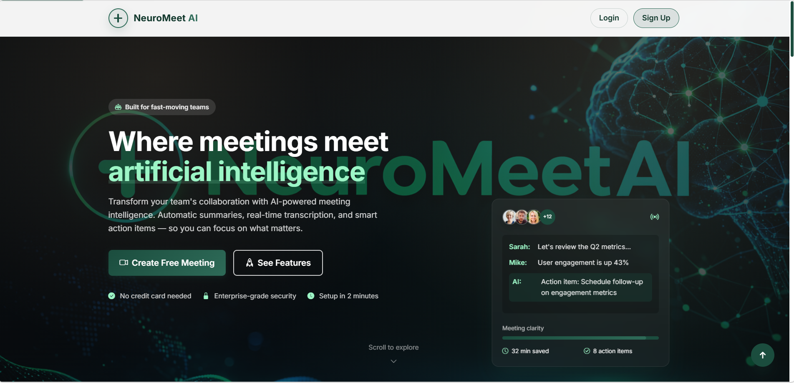

# NeuroMeet AI

NeuroMeet AI is a Django + Channels realtime meeting app with WebRTC video rooms, live chat, file sharing, whiteboard collaboration, profile management, and a browser-side AI meeting assistant.
## UI Preview

## Current Feature Set

- Multi-user meeting rooms with unique room URLs
- WebRTC-based video calling and media controls
- Screen sharing
- Real-time chat over WebSockets
- Participant list, reactions, hand raise, and live status sync
- File sharing inside the room
- Collaborative whiteboard
- User authentication, profile settings, and profile avatars
- AI dashboard with:
  - meeting summaries
  - transcript view
  - action item extraction
  - highlights and topic tags
  - attendance tracking
  - engagement insights
  - smart replies
  - assistant/chatbot panel

## Stack

- Backend: Django 5, Channels, Daphne
- Realtime: WebSockets, optional Redis channel layer
- Frontend: HTML, CSS, vanilla JavaScript
- Database: SQLite
- Video: WebRTC
- Auth: Django auth + optional Google/GitHub social login

## Project Structure

```text
.
|-- .env.example
|-- README.md
|-- neuromeet/
|   |-- manage.py
|   |-- ai_assistant/
|   |-- meetings/
|   |-- neuromeet/
|   |-- static/
|   `-- templates/
```

Important files:

- `neuromeet/neuromeet/settings.py`: Django, Channels, security, env config
- `neuromeet/neuromeet/asgi.py`: ASGI entrypoint
- `neuromeet/meetings/consumers.py`: meeting websocket consumer
- `neuromeet/static/js/meeting.js`: room realtime + WebRTC client
- `neuromeet/static/js/meeting-ai.js`: AI/notes/insights client
- `neuromeet/templates/room.html`: main meeting UI

## Local Setup

### 1. Clone the repository

```bash
git clone https://github.com/mianhamzaathar/Real-Time-Communication-App_Fullstackwebdev_muhammammdhamzaathar.git
cd Real-Time-Communication-App_Fullstackwebdev_muhammammdhamzaathar
```

### 2. Create and activate a virtual environment

Windows PowerShell:

```powershell
python -m venv .venv
.venv\Scripts\Activate.ps1
```

macOS / Linux:

```bash
python -m venv .venv
source .venv/bin/activate
```

### 3. Install dependencies

```bash
pip install -r requirements.txt
```

### 4. Create the environment file

The app loads `.env` from inside the `neuromeet/` directory.

Windows PowerShell:

```powershell
Copy-Item .env.example neuromeet\.env
```

macOS / Linux:

```bash
cp .env.example neuromeet/.env
```

### 5. Run migrations

```bash
cd neuromeet
python manage.py migrate
```

### 6. Start the app

```bash
python manage.py runserver
```

Open:

- Landing page: `http://127.0.0.1:8000/`
- App home: `http://127.0.0.1:8000/home/`

## Environment Variables

Use `.env.example` as the base template.

| Variable | Purpose |
|---|---|
| `DJANGO_SECRET_KEY` | Django secret key |
| `DEBUG` | Development mode toggle |
| `ALLOW_ALL_HOSTS_IN_DEBUG` | Allows wildcard hosts during local debug |
| `ALLOWED_HOSTS` | Comma-separated allowed hosts |
| `APP_BASE_URL` | Public site URL, used to help populate host and CSRF settings |
| `CSRF_TRUSTED_ORIGINS` | Comma-separated trusted origins |
| `ENABLE_HTTPS` | Enables secure cookies and HTTPS redirects |
| `USE_WHITENOISE` | Enables WhiteNoise static file serving |
| `SERVE_MEDIA` | Serves uploaded media files through Django |
| `DATABASE_URL` | Optional database URL for Postgres or SQLite |
| `REDIS_URL` | Optional Redis connection for Channels |
| `MEDIA_ROOT` | Override upload storage path |
| `STATIC_ROOT` | Override collected static files path |
| `SOCIAL_AUTH_GOOGLE_OAUTH2_KEY` | Google OAuth client ID |
| `SOCIAL_AUTH_GOOGLE_OAUTH2_SECRET` | Google OAuth client secret |
| `SOCIAL_AUTH_GITHUB_KEY` | GitHub OAuth client ID |
| `SOCIAL_AUTH_GITHUB_SECRET` | GitHub OAuth client secret |

## Deploy On Render

This repository now includes:

- `requirements.txt` for Python dependencies
- `Procfile` for generic PaaS startup
- `render.yaml` for one-click Render setup
- `.python-version` to keep deployment on Python `3.10.11`

### Quick Render flow

1. Push this repository to GitHub.
2. In Render, create a new Blueprint and point it at this repo.
3. Render will create:
   - one Python web service
   - one Postgres database
   - one Key Value instance for Redis
4. After the first deploy, open the generated `.onrender.com` URL.

### Important production notes

- The app starts with Daphne so HTTP and WebSockets run through the ASGI app.
- Static files are collected during build and served with WhiteNoise.
- The default `render.yaml` uses free Render plans for easier demos.
- Free Render web services lose local uploaded files on restart/redeploy, so profile avatar uploads are not durable on the free plan.
- For a more durable production setup, move media to object storage or upgrade to a paid web service with persistent storage.
- This project still uses STUN-only WebRTC by default, so some real-world peer connections may need a TURN server to be fully reliable.

## Main Routes

- `/` - landing page
- `/home/` - authenticated app home/dashboard-style page
- `/signup/` - signup
- `/login/` - login
- `/profile/` - profile page and avatar upload
- `/pricing/` - pricing page
- `/contact-sales/` - contact sales form
- `/room/` - redirects to a generated room
- `/room/<room_code>/` - live meeting room

WebSocket room endpoint:

- `/ws/meeting/<room_code>/`

## Realtime Notes

- If `REDIS_URL` is not set, the app uses an in-memory channel layer.
- Redis is recommended for multi-user production deployments across multiple processes.
- For local development, the current setup works without Redis.

## AI Notes

The AI layer in this project is currently browser-side and heuristic-driven. It includes transcription helpers, summaries, action items, attendance, smart replies, and insight panels, but it is not a hosted LLM backend.

Important limitations:

- speech-to-text depends on browser support
- translation is lightweight and rule-based
- noise handling uses browser/device audio processing
- this is not end-to-end encrypted meeting AI infrastructure

## Validation

Useful checks during development:

```bash
python manage.py check
node --check static/js/meeting.js
node --check static/js/meeting-ai.js
```

Run the `node --check` commands from inside the `neuromeet/` directory.

## Manual Test Flow

To quickly test the app:

1. Start the server.
2. Open the app in two browser tabs or two browsers.
3. Create or join the same room code.
4. Test mic/camera, screen share, chat, file share, whiteboard, and leave flow.
5. Open the AI panels to review transcript, notes, and attendance behavior.

## Known Gaps

- No bundled TURN server configuration
- File sharing is room-level demo storage, not persistent cloud storage
- AI features are not backed by a remote LLM/STT pipeline by default

## License

This repository currently does not define a license file.
